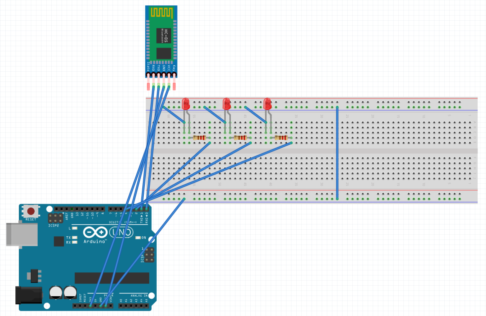

# Voice Activation Light System
`Author:` Gabriel Tindi

This project focuses on creating a voice-controlled lighting system to enhance user convenience using Arduino programming language.

## Background
Voice-activated systems provide an intuitive and hands-free approach to interact with electronic
devices. This project focuses on creating a voice-controlled lighting system to enhance user
convenience.

## System Components:
<ol>
<li>Arduino Mega / Arduino Uno</li>
<li>HC-05 Bluetooth Module</li>
<li>Breadboard</li>
<li>LED Lights/ Light Bulbs</li>
<li>Jumper Wires</li>
<li>Resistors</li>
<li>Android app `Arduino BlueControl` available on google playstore </li>
</ol>

- The objective of this application is to identify voice commands and transmit them through Serial Communication HC-05 to the Arduino Board. Make sure that your HC-05 Bluetooth module is appropriately paired with the device from which you intend to send commands. Double-check the Bluetooth pairing settings on your device and ensure a stable connection with the HC-05 module.

`NB: Before uploading the sketch below, ensure that you disconnect the RX and TX connections from the Arduino to avoid potential uploading errors.`

<b>Circuit Diagram:</b>

## Conclusion
After uploading the sketch, the Arduino-based voice activation light system is ready to receive commands. The system utilizes an HC-05 Bluetooth module to wirelessly receive voice commands from a paired device. The Arduino processes these commands, controlling the state of four different colored LEDs. The voice commands, such as 'on,' 'off,' or specific colors, trigger corresponding actions to illuminate or turn off the LEDs. The system establishes a seamless interaction between the user and the Arduino, providing a versatile and engaging voice-controlled lighting experience.